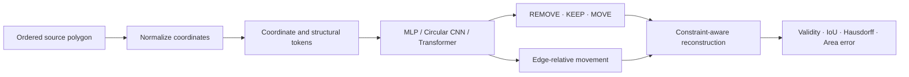
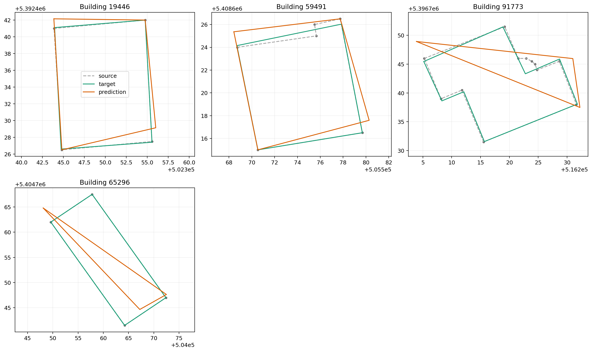

# VectorMapFormer

[](https://github.com/goapu/vector-map-former/actions/workflows/vector-map-former-ci.yml)
[](https://www.python.org/)
[](LICENSE)

Coordinate-native deep-learning baselines for cartographic building
generalization. VectorMapFormer treats an ordered polygon ring as a geometric
sequence and predicts a `REMOVE`, `KEEP`, or `MOVE` action for every vertex,
with edge-relative displacement regression for moved vertices.

The repository is a production-oriented research prototype inspired by the
Cart2Former research direction. It is not an implementation of that project
and makes no unverified novelty or performance claim.

## Why this project

Rasterization discards the exact coordinate structure that cartographic
generalization must ultimately edit. This project instead operates directly on
vector coordinates and provides a controlled comparison between local,
circular-convolutional, absolute-position Transformer, and ring-relative
Transformer models.



## Implemented

- Strict and auditable adapter for the public MapGeneralizer object arrays.
- Translation- and scale-normalized coordinate features computed from source
  geometry rather than trusted preprocessing columns.
- Variable-length polygon batching with explicit masks and no silent
  truncation.
- MLP, circular CNN, vanilla Transformer, and cyclic-relative Transformer.
- Balanced action classification and MOVE-only Smooth L1 regression.
- Deterministic data loaders, early stopping, gradient clipping, and atomic
  checkpoints.
- Classification, movement, polygon validity, IoU, Hausdorff, and relative
  area metrics.
- Safe checkpoint loading, JSON experiment records, compressed predictions,
  and qualitative visualizations.
- Tests for data validation, loss masking, padding invariance, cyclic shift
  equivariance, circular behavior, checkpoint safety, and reconstruction.

## Qualitative smoke output

Gray dashed rings are source buildings, green rings are targets, and orange
rings are model predictions. These examples verify the complete pipeline; they
are not evidence of converged model quality.



See [docs/SMOKE_TEST.md](docs/SMOKE_TEST.md) for the measured one-epoch
verification results and their limitations.

## Quick start

```bash
git clone https://github.com/goapu/vector-map-former.git
cd vector-map-former
python3 -m venv .venv
source .venv/bin/activate
python -m pip install --upgrade pip
python -m pip install -e '.[geometry,dev]'
```

Python 3.10–3.13 and PyTorch 2.x are supported.

## Dataset

Download the public MapGeneralizer repository separately:

```bash
git clone https://github.com/chouisgiser/MapGeneralizer.git
```

The required files are `vertex_train.npy`, `vertex_valid.npy`, and
`vertex_test.npy`. Do not commit them here. The arrays require
`allow_pickle=True`, so only load copies obtained from a trusted source.

The verified local copy contains 8,493 buildings and no building-ID overlap
between train, validation, and test. The associated paper reports 8,494; this
repository records the discrepancy rather than silently repairing it. See
[data/README.md](data/README.md) for the full column contract and licensing
caveat.

Audit a local copy before training:

```bash
vmf inspect \
  --data-dir "/absolute/path/MapGeneralizer/data/input" \
  --output outputs/data_audit.json
```

## Train

Run the independent-vertex baseline:

```bash
vmf train \
  --config configs/baseline.yaml \
  --data-dir "/absolute/path/MapGeneralizer/data/input" \
  --model mlp \
  --output-dir outputs/mlp
```

Run the ring-relative Transformer:

```bash
vmf train \
  --config configs/baseline.yaml \
  --data-dir "/absolute/path/MapGeneralizer/data/input" \
  --model ring_transformer \
  --movement-weight 0.25 \
  --output-dir outputs/ring_transformer
```

Each run records the resolved configuration, runtime metadata, data audit,
training history, best checkpoint, test metrics, and optional predictions.

## Evaluate and visualize

```bash
vmf evaluate \
  --checkpoint outputs/ring_transformer/best_model.pt \
  --data-dir "/absolute/path/MapGeneralizer/data/input" \
  --split test \
  --output outputs/ring_transformer/test_metrics.json

vmf visualize \
  --checkpoint outputs/ring_transformer/best_model.pt \
  --data-dir "/absolute/path/MapGeneralizer/data/input" \
  --split test \
  --examples 9 \
  --output outputs/ring_transformer/predictions.png
```

## Repository layout

```text
configs/                 Reproducible experiment configurations
data/                    Dataset contract and local placement instructions
docs/                    Architecture, design, and verification notes
src/vector_map_former/   Installable Python package
tests/                   Unit and invariance tests
.github/workflows/       Continuous-integration quality gate
```

## Development

```bash
make install
make check
```

`make check` runs Ruff linting and formatting checks, strict MyPy, and Pytest.
GitHub Actions runs the same gate on `main` and on pull requests. See
[CONTRIBUTING.md](CONTRIBUTING.md) for the development contract.

## Research boundaries

The current benchmark addresses single-building simplification. It does not
yet establish neighboring-object aggregation, road-aware conflict resolution,
network thinning, hierarchical pooling, self-supervised OpenStreetMap
pretraining, or free-coordinate autoregressive generation. Those are explicit
research milestones, not completed features.

Additional documents:

- [Architecture](docs/ARCHITECTURE.md)
- [Research roadmap](docs/RESEARCH_ROADMAP.md)
- [Smoke-test record](docs/SMOKE_TEST.md)

## References

- Zhou, Z., Fu, C., and Weibel, R. (2023). *Move and remove: Multi-task
  learning for building simplification in vector maps with a graph
  convolutional neural network.*
  <https://doi.org/10.1016/j.isprsjprs.2023.06.004>
- Wamhoff, M., Baerenzung, J., Kaufhold, L., and Kada, M. (2025).
  *CNN-Based Geometric Feature Embedding Using Coordinates for Cartographic
  Generalization Tasks on Building Footprints.*
  <https://doi.org/10.5194/ica-proc-7-26-2025>

## License and citation

Source code is available under the [MIT License](LICENSE). Cite this prototype
using [CITATION.cff](CITATION.cff), and cite the original dataset publication
when using MapGeneralizer data.
