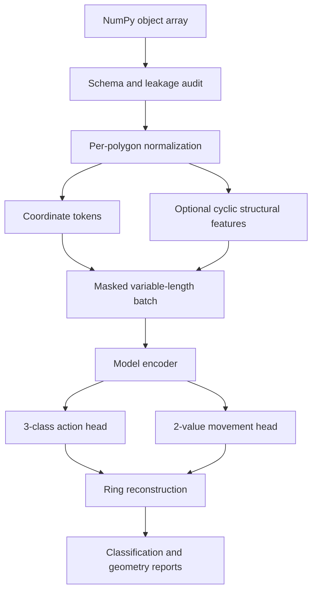

# Architecture

## Data contract

Each MapGeneralizer object-array element represents one ordered building ring.
The adapter validates its 13-column schema, building identity, vertex order,
finite values, action labels, and configured maximum length before exposing a
sample.

The supervised targets are:

- action `0`: `REMOVE`;
- action `1`: `KEEP`;
- action `2`: `MOVE`;
- two signed movement components along the incident polygon edges.

Coordinates are centered on the area-weighted polygon centroid and divided by
the maximum axis extent. Movement targets use the same scale. The original
projected coordinates, centroid, and scale remain available for reconstruction
and metric computation.

## Processing flow

## Models

| Model | Purpose | Sequence interaction |
|---|---|---|
| `mlp` | Independent-vertex control | None |
| `circular_cnn` | Local cyclic baseline | Circular 1D convolution |
| `transformer` | Global sequence baseline | Absolute-position attention |
| `ring_transformer` | Polygon-aware hypothesis | Cyclic-relative and optional geometric attention bias |

The ring-relative attention bias indexes the shortest cyclic distance between
two vertices. Optional geometric buckets add pairwise coordinate-distance
information. Padded keys are masked, padded outputs are reset to zero, and the
test suite verifies both padding invariance and cyclic shift equivariance.

## Objective

The total training objective is class-weighted action cross-entropy plus a
weighted Smooth L1 movement loss. Movement regression is evaluated only on
vertices whose reference action is `MOVE`. This prevents retained or removed
vertices from dominating the displacement objective.

## Reconstruction and metrics

Predicted actions retain ring order. Removed vertices are omitted; kept
vertices preserve their source coordinate; moved vertices are reconstructed by
solving the two incident-edge projection equations. Under-defined and invalid
polygons are reported rather than silently repaired.

The evaluation layer reports:

- accuracy, balanced accuracy, macro-F1, and per-class precision/recall/F1;
- normalized movement component MAE and endpoint error;
- invalid reference and prediction counts;
- IoU, Hausdorff distance, and relative area error for valid geometries.

## Artifact contract

A training run produces a data audit, resolved configuration, runtime record,
epoch history, atomic best checkpoint, test report, and optional compressed
predictions. Checkpoints use an explicit format version and are loaded with
PyTorch's weights-only mode.
